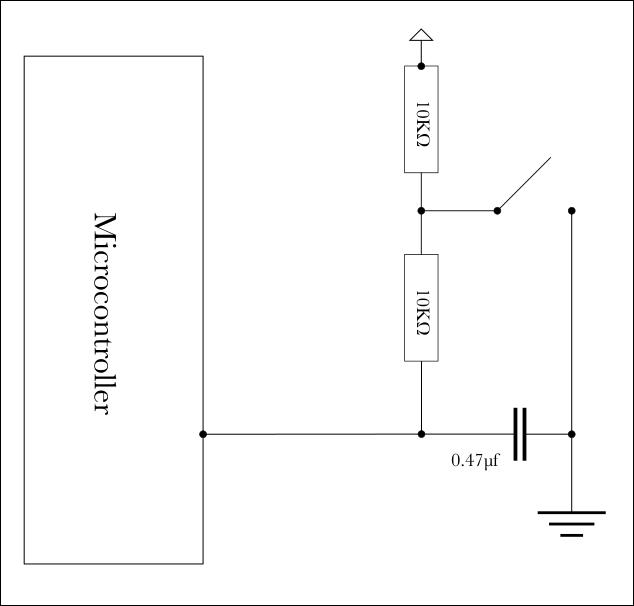

# Debounce For Interrupts
Debounce a momentary pushbutton for use as an external interrupt source, by means of a resistor-capacitor (RC) network.

A momentary pushbutton looks like a simple device. Press it down to close a circuit; release it and it springs back up, opening the circuit. 

Pushbuttons show up early in entry-level projects for learners just beginning to explore Arduino and other code-enabled devices. The way they work is intuitively obvious for activating a light or pulsing a motor. However, such seeming ease conceals a problem.

## The Problem
The result of pushing the button becomes unpredictable at very short intervals of time during its movement between the fully-up and fully-down positions. This causes difficulty for using the pushbutton as an interrupt source. The origin of this problem is &ldquo;switch contact bounce&rdquo;.

I cannot explain the electromagnetic theory behind switch contact bounce. I only hope to describe the phenomenon well enough to reckon with it in an Arduino project.

Pictures will replace many words.

## Visualizing Contact Bounce
Like all mechanical switches, a momentary pushbutton brings two electrical conductors together. We like to imagine that when they touch, current passes from one into the other. and when they separate, it stops.

Unfortunately, things are not so simple. Just as the lightning jumps between storm clouds and the ground, electricity can leap across the gap between conductors in a pushbutton. The button will then appear to have been pushed and released many times in rapid succession. A few screen images from an oscilloscope provide some examples.

 
**Image 1: What We Desire**

Image 1 is more or less what we hope will happen. Pressing the button drops the voltage immediately to 0 volts from 5 volts, and it stays there.

 
**Image 2: What Can Actually Happen**

Image 2 is what sometimes actually does happen, pressing the same button. The voltage jumps rapidly up and down. It hits zero for an instant then flicks back and forth, 0 to 5 volts and back again, plus myriad levels in between, finally settling at zero.

The fluctuation shown in Image 2 continues for about four milliseconds. Each of those bounces can trigger two interrupts, one in each direction.

 
**Image 3: What Frequently Happens**

Image 3 may be more typical, having just a few bounces over a shorter period. Even this behavior presents problems when a program needs to gauge the state of a pushbutton to a high degree of certaintly. 

## Coping with Contact Bounce
Bounces introduce uncertainty as to the state of a pushbutton. We have three ways to deal with the problem.

### Way #1: Ignore It
This is what we do when the bounces simply do not matter. One example might be pushing a button to ring a doorbell. The action takes place in *human-perceptible time*. A person simply holds the button down until they hear the doorbell sound, then releases it. The bounces happen so fast that neither the human nor the doorbell takes any notice of them.

### Way #2: Wait for It to Stop
Microcontrollers can resolve the problem by means of their built-in timers. The idea is to wait for some chosen interval of time, in hopes that the bouncing will cease, before accepting the voltage reading. 

Various approaches to so-called *software-based debouncing* are described in many articles that other people have posted online. Choose your favorite. 

Note that debouncing with software may work best in situations where the built-in timers are awake and already running up to speed before the button is pushed.

A more definite approach might be needed in situations where the timers are halted and the system is sleeping in a low-power mode.

### Way #3: Prevent Bounce with Hardware
For interrupts designed to wake up a sleeping processor to take a definite action when a button is pushed, it may be preferable for the voltage to change smoothly. Image 4 shows an example of voltage decreasing to 0 from 5 volts over a short interval of time.

 
**Image 4: Voltage Change Smoothed with Hardware**

The result shown in Figure 4 is produced by combining two resistors and a capacitor with the button into a *resistor-capacitor network*. Such an RC network spreads the voltage change across time. The button still exhibits switch contact bounce; however, the capacitor absorbs the fluctuations while the resistors smooth them out.

A digital input pin on the ATmega32P processor of an Arduino begins to read as &ldquo;logical-low&rdquo; at voltage levels less than 2.3 volts. Image 4 shows this level being reached roughly 3 milliseconds after the pushbutton first makes contact. 

The network that produced Image 4 combines two 10K-Ohm resistors with a 0.47 microFarad capacitor. Image 5 gives a schematic diagram of the arrangement.

 
**Image 5: an RC Network for a Pushbutton**

The capacitor charges through the two resistors while the pushbutton is in the *up* (released) position. When the putton is pressed down, the capacitor discharges to ground through the resistor between it and the button.  

## Nothing Is Perfect
Alas, an RC network might not suppress every bounce. Very infrequently, I have seen 'scope images, for the RC network depicted above, where a late bounce increases the voltage to more than 2.3 before decreasing again. 

Such an event might trigger a second interrupt. The program design would need to take this possibility into account.

RC networks are wonderfully flexible. For example, increasing the size of the capacitor would lengthen the time it takes for the voltage to decrease. Lengthening the time would increase the reliablity of the signal, at the cost of a slower response to the pushbutton. Such details may be determined experimentally during the prototyping phase of a project. 
